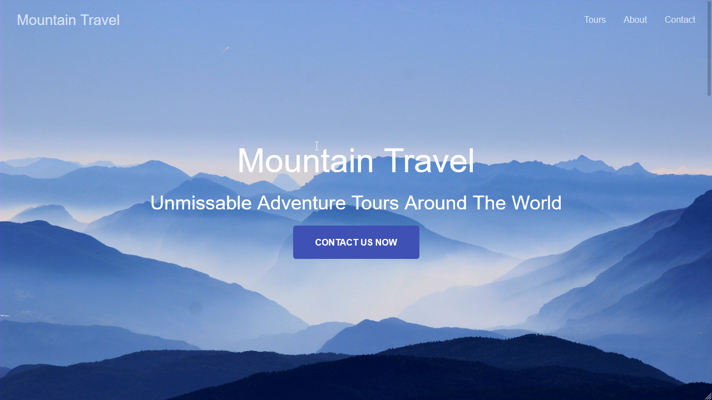

# [Mountain Travel](https://kristopherborel.me/mountain-travel/)

A website layout created from a design mock and built with React.



## Built with

- React
- styled-components

## Run the project locally

**1.** Clone the project:

```
$ git clone https://github.com/kborel/mountain-travel.git
$ cd mountain-travel
```

**2.** Install dependencies:

```
$ npm install
```

**3.** Run:

```
$ npm start
```